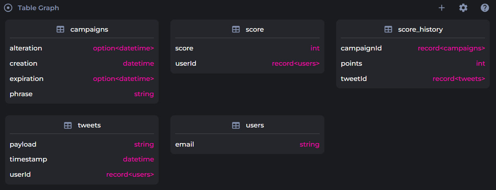
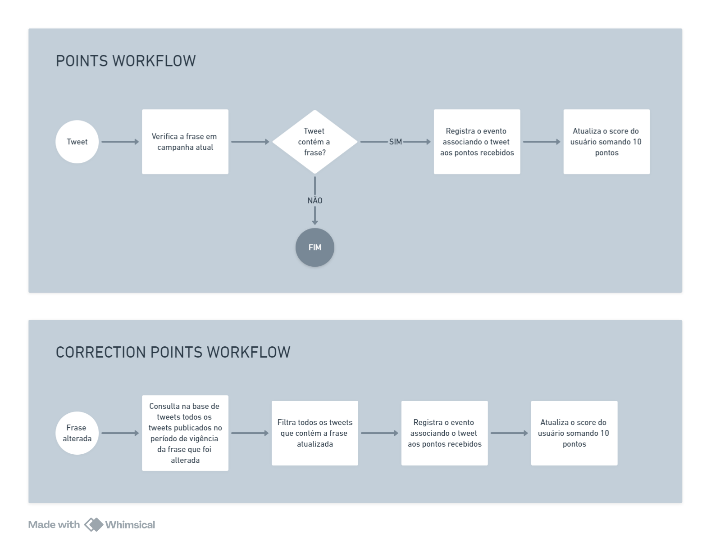

# Campaign points project

Este projeto está dividido em 3 módulos (que num cenário real provavelmente seriam serviços diferentes):
- Tweets - onde um usuário pode criar um tweet e recuperar tweets listados
- Campaign - onde um usuário pode criar uma campanha, editar uma campanha e listar campanhas existentes
- Points - onde fica o mecanismo de atribuição de pontos caso surja um tweet atrelado a uma campanha em vigor.

### Tecnologias utilizadas:
- Java + Spring Boot
- SurrealDB
- Temporal

### Tabelas criadas:


### Lógica da atribuição de pontos:

---
# Endpoints expostos

---
## API Campanha
### Criar campanha
- **Method:** POST
- **Path:** /campaigns
- **Parameters:**
    - **Request Body:**
        - Content Type: application/json
        - Schema:
             ```json
              {
                  "phrase": "nova campanha lançada"
              }
- **Responses:**
    - 200: OK
        - Content Type: application/json
        - Schema:
            ```json
            {
                "id": "campaigns:ckolgfm2vjc1ym3uoizo",
                "phrase": "nova campanha lançada",
                "creation": "2024-04-14T16:46:54.6933802",
                "alteration": null,
                "expiration": null
            }
          
### Corrigir campanha
- **Method:** PUT
- **Path:** /campaigns/{phraseId}
- **Parameters:**
    - `phraseId` (path) - ID da campanha a ser corrigida.
    - **Request Body:**
        - Content Type: application/json
        - Schema: 
             ```json
              {
                  "phrase": "nova campanha lançada"
              }

- **Responses:**
    - 200: OK
        - Content Type: application/json
        - Schema:
            ```json
            {
                "id": "campaigns:ckolgfm2vjc1ym3uoizo",
                "phrase": "nova campanha lançada",
                "creation": "2024-04-14T16:46:54.6933802",
                "alteration": null,
                "expiration": null
            }

### Listar todas as campanhas
- **Method:** GET
- **Path:** /campaigns
- **Responses:**
    - 200: OK
        - Content Type: application/json
        - Schema:
            ```json
            [
                {
                    "id": "campaigns:ckolgfm2vjc1ym3uoizo",
                    "phrase": "nova campanha lançada",
                    "creation": "2024-04-14T16:46:54.6933802",
                    "alteration": null,
                    "expiration": null
                },
                {
                    "id": "campaigns:ckolgfm2vjc1ym3uoizo",
                    "phrase": "nova campanha lançada",
                    "creation": "2024-04-14T16:46:54.6933802",
                    "alteration": null,
                    "expiration": null
               }
           ]
---
## API Tweets
### Criar tweet
- **Method:** POST
- **Path:** /tweets
- **Parameters:**
    - **Request Body:**
        - Content Type: application/json
        - Schema:
             ```json
              {
                  "payload": "[frase campanha] tweet"
                  "userId": "users:alice"
              }
- **Responses:**
    - 200: OK
        - Content Type: application/json
        - Schema:
            ```json
            {
                "id": "tweets:6462dy2dqzibi4mcb29d",
                "payload": "test 3",
                "timestamp": "2024-04-14T16:46:21.7323649",
                "userId": "users:alice"
            }

### Listar todos os tweets
- **Method:** GET
- **Path:** /campaigns
- **Responses:**
    - 200: OK
        - Content Type: application/json
        - Schema:
            ```json
            [
                {
                    "id": "tweets:6462dy2dqzibi4mcb29d",
                    "payload": "test 3",
                    "timestamp": "2024-04-14T16:46:21.7323649",
                    "userId": "users:alice"
                },
                {
                    "id": "tweets:6462dy2dqzibi4mcb29d",
                    "payload": "test 3",
                    "timestamp": "2024-04-14T16:46:21.7323649",
                    "userId": "users:alice"
                }
           ]
---
## API Points
### Listar todos os scores
- **Method:** GET
- **Path:** /points
- **Responses:**
    - 200: OK
        - Content Type: application/json
        - Schema:
            ```json
            [
                {
                    "id": "tweets:6462dy2dqzibi4mcb29d",
                    "userId": "users:alice"
                    "score": 100,
                    
                },
                {
                    "id": "tweets:6462dy2dqzibi4mcb29d",
                    "userId": "users:mary"
                    "score": 80,
                },
                {
                    "id": "tweets:6462dy2dqzibi4mcb29d",
                    "userId": "users:bob"
                    "score": 40,
                }
           ]
---


